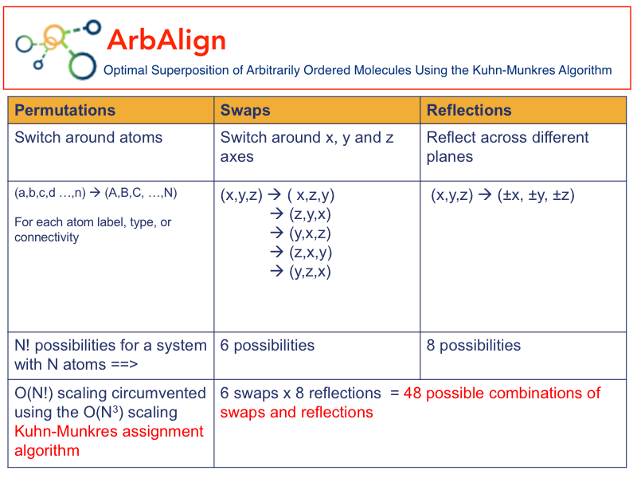
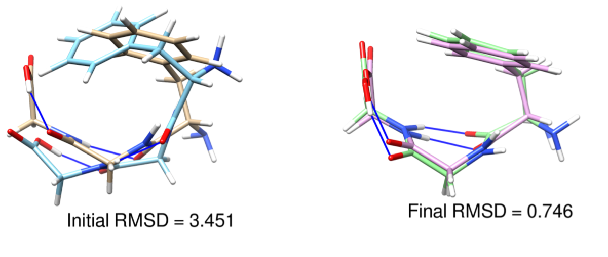

# Purpose
ArbAlign is a small tool for optimally aligning two arbitrarily ordered isomers using the
Hungarian or Kuhn-Munkres algorithm. The final ordering of the two isomers should give the lowest
root mean-square distance (RMSD) between the two structures.


# Contents
The repo contains the following items:
* `Examples` - a directory containing coordinates of different molecular systems to play around with
* `Paper` - the manuscript and supporting information of the companion paper to this work
* `ArbAlign-driver.py` - a Python source code for the munkresRMSD script,
* `ArbAlign.py/ ArbAlign-standard.py/` - a Python script using the [faster implementation of Hungarian algorithm](https://github.com/Hrldcpr/Hungarian)
* `ArbAlign-scipy.py/` - a Python script using the [slower SciPy implementation of Hungarian algorithm](https://docs.scipy.org/doc/scipy-0.18.1/reference/generated/scipy.optimize.linear_sum_assignment.html)
* `PrinCoords.py` - a Python source code for calculating principal coordinates
* `genTypes.csh` – a shell script to use OpenBabel to convert a Cartesian (XYZ) file to a SYBYL Mol2 file formatted as a conventional XYZ file
* `genConn.csh` – a shell script to use OpenBabel to convert a Cartesian (XYZ) file to a NMA connectivity file formatted as a conventional XYZ file
* `RMSD-Kabsch.py` - a Python script for calculating RMSDs by Jimmy Charnley Kromann (jimmy@charnley.dk) and Lars Bratholm's script from https://github.com/charnley/rmsd - Accessed on Nov 10, 2015. Please see rmsd-script/LICENSE for usage rights.

# Usage
`ArbAlign-driver.py` is a Python driver script to run Hungarian optimal RMSD matching.
ArbAlign can be used either as a command line or web tool. The command line tool has a driver script
that can take in many options or resort to sensible defaults when necessary.

```
Usage: ArbAlign-driver.py [-b/--by {l, t, c}] [-n/--noHydrogens] [-s/--simple] A.xyz B.xyz

   -b {l,t,c}, --by {l,t,c}
     Match atoms by l-label, SYBYL t-type, or NMA connectivity (-c).
     The default is by atom label (-l)
   -s, --simple
     Perform Kuhn-Munkres assignment reordering without axes swaps and reflections.
     The default is to perform axes swaps and reflections
   -n, --noHydrogens
     Ignore hydrogens.
     The default is to include all atoms
```
# Examples

`ArbAlign.py  A.xyz B.xyz`

`ArbAlign-driver.py  A.xyz B.xyz`

`ArbAlign-driver.py --by c --noHydrogens A.xyz B.xyz`

`ArbAlign-driver.py --simple --noHydrogens A.xyz B.xyz`

## Alignment by label, atom type or NMA connectivity
```
   -b {l,t,c},
   --by {l,t,c}
```
The default is to align the isomers by element or atom label (-l). If one wants to align the isomers
by the elements' SYBYL atom type or NMA connectivity, the driver needs to interface with OpenBabel.
Match atoms by l-label, SYBYL t-type, or NMA connectivity (-c).

## Consider all axes swaps and reflections or original axes only
```
   -s,
   --simple
```
Perform Kuhn-Munkres assignment reordering without axes swaps and reflections.
The default is to perform axes swaps and reflections

## Consider all atoms or heavy atoms only
```
   -n,
   --noHydrogens
```
Ignore hydrogens.
The default is to include all atoms

# Requirements
## Python 2.7+
* Python `numpy` module. If you don't have it already, you can install it using `pip`
   * `pip install numpy`
* Python `hungarian` module.
   * `pip install hungarian`
   * If you want to install it from source, please see https://github.com/Hrldcpr/Hungarian. You would either want to copy the file `build/lib-XXX/hungarian.so` into a location that's included in your `$PYTHONPATH` or whatever directory you are running ArbAlign from.
* If you prefer to use the slower `scipy` linear assignment solver, you would need to install it
  using pip :  `pip install scipy`.

## Other Tools Needed to Align by Atom Type or Connectivity
* `OpenBabel` - We use OpenBabel to convert Cartesian coordinates (XYZ) to formats containing atmm types including connectivity and hybridization information. It is necessary to use OpenBabel to convert the Cartesian coordinates to SYBYL Mol2 (sy2) and MNA (mna) formats.
* `genTypes.csh` - a small shell script which converts XYZ file to SYBYL Mol2 (sy2) format and recasts the atom label to contain atom type information.
* `genConn.csh` - a small shell script which converts XYZ file to NMA (nma) format and recasts the atom label to contain atom's bonding/connectivity information.


# Output
If the pairs of structures pass a sanity test, the tool will align them optimally and provide the
following information.
* The initial Kabsch RMSD,
* The Kuhn-Munkres reorderings for each atom and the corresponding RMSDs,
* The final Kabsch RMSD after the application of the Kuhn-Munkres algorithm, and
* The coordinates corresponding to the best alignment of the second structure with the first.

For example, aligning `Examples/Simple/Mol-A` and `Examples/Simple/Mol-B` using `ArbAlign-driver.py  Mol-A.xyz Mol-B.xyz` would print
<pre>
[('H', 17), ('C', 13), ('O', 4), ('N', 3)]
C Swap: (0, 1, 2) Refl: (1, 1, 1) RMSD: 3.6057335750670982 [1, 0, 5, 6, 4, 9, 3, 7, 8, 2, 10, 11, 12]
H Swap: (0, 1, 2) Refl: (1, 1, 1) RMSD: 2.7427738425469443 [0, 3, 4, 1, 6, 7, 5, 2, 10, 9, 8, 12, 11, 15, 14, 16, 13]
N Swap: (0, 1, 2) Refl: (1, 1, 1) RMSD: 2.7427738425469443 [0, 1, 2]
O Swap: (0, 1, 2) Refl: (1, 1, 1) RMSD: 2.725809328162452 [0, 1, 3, 2]
.
.
(48x)
.
.
Swap Transform: (0, 1, 2)
Reflection Transform: (-1, -1, -1)
Initial unsorted RMSD: 3.996
Initial   sorted RMSD: 3.388
Best             RMSD: 0.746
Best alignment of Mol-B.xyz with Mol-A.xyz is written to Mol-B-aligned_to-Mol-A.xyz
</pre>

One can generate a graphic representation of the alignment using [UCSF Chimera](https://www.cgl.ucsf.edu/chimera/) that would look something like this:



# Citation
If you find this tool useful for any publishable work, please cite the companion paper:

Berhane Temelso, Joel M. Mabey, Toshiro Kubota, Nana Appiah-padi, George C. Shields.  `J. Chem. Info. Model.` **2017**, 57 (5), 1045–1054
http://doi.org/10.1021/acs.jcim.6b00546
